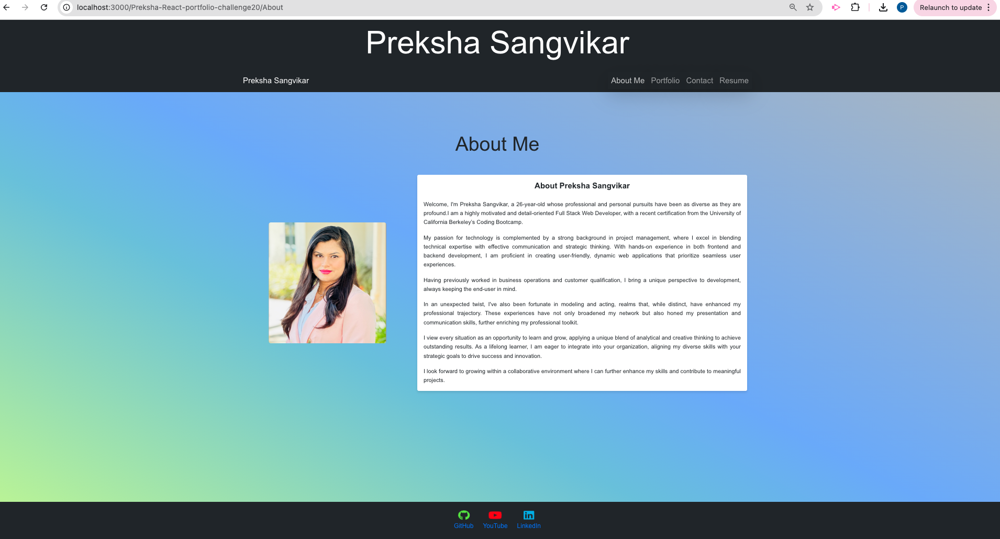
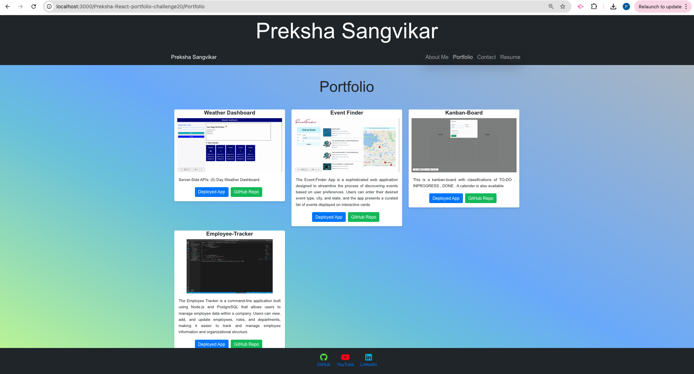
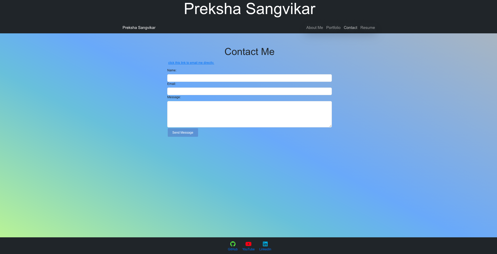
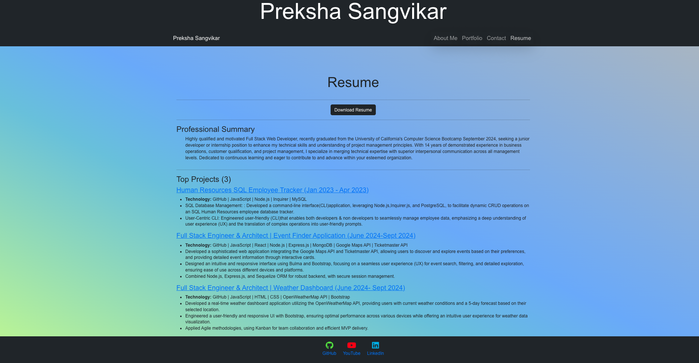

# Preksha-React-portfolio-challenge20
The "Preksha-React-Portfolio-Challenge20" is designed to test and enhance your skills in creating a professional portfolio using React. This challenge aims to help you showcase projects, skills, and experiences in a dynamic and visually appealing way, making it easier to impress potential employers or clients.

# Description 

The Preksha-React-Portfolio-Challenge20 is a comprehensive project aimed at creating a professional portfolio using React. This project allows you to organize and display your skills, projects, and professional experiences in a well-structured and aesthetically pleasing format. The portfolio includes features such as an About Me section, Projects, Skills, Contact Information, and more, all dynamically rendered and responsive for various devices. This challenge is perfect for developers who want to create a polished portfolio to showcase their capabilities to potential employers or clients.

## Table of Contents

* [Description](#description)

* [Usage Instructions](#usage-instructions)

* [Installation](#installation)

* [Features](#features)

* [Screenshots](#screenshots)

* [Demo](#Demo)

* [Questions](#questions)

# Usage Instructions 

To use this portfolio:

* Clone the repository to your local machine.

* Install the required dependencies using npm install.

# Installation 

To get started with the Preksha-React-Portfolio-Challenge20:

* Clone the repository: git clone https://github.com/Preksha2408/Preksha-React-Portfolio-Challenge20.git

* Navigate into the project directory: cd Preksha-React-Portfolio-Challenge20

* Install the dependencies: npm install

* Start the development server: npm start

* My portfolio will be available at http://localhost:3000

# Features 

* Responsive Design: Ensures that your portfolio looks great on all devices, from mobile phones to desktops.

* Interactive UI:  smooth animations and transitions, make the portfolio visually appealing.

* Modular Codebase: Organized React components make the code easy to maintain and extend with new features.

* About Me Section: My  professional journey, skills, and experiences .

* Projects Showcase: Display your best work with descriptions, technologies used, and links to live demos and source code.

* Contact Form: Allow visitors to reach out directly through a functional contact form.

# Screenshots 

# Demo 

Youtube video link : [Click here](https://www.youtube.com/watch?v=j0LVsY-fwx4)

## Questions 

For questions or further information, please contact me:

* Email - [prek.ps37@gmail.com](prek.ps37@gmail.com)

* GitHub - [Preksha2408](https://github.com/Preksha2408/Preksha-React-portfolio-challenge20.git)

* Deployed link - https://preksha-react-portfolio.netlify.app/

